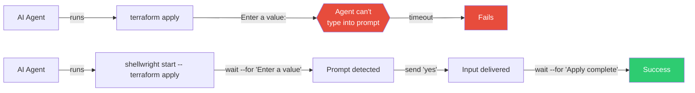
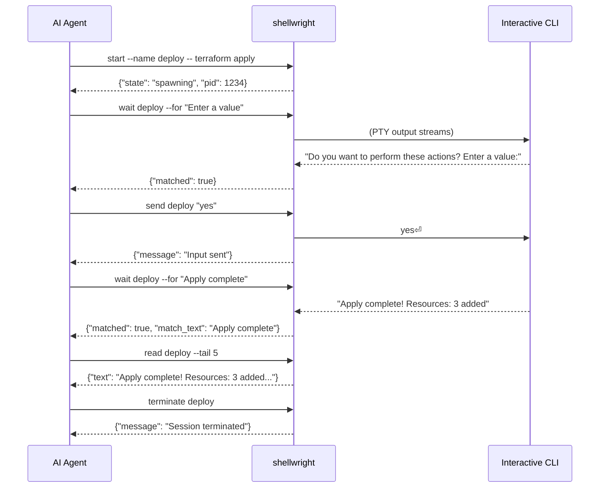
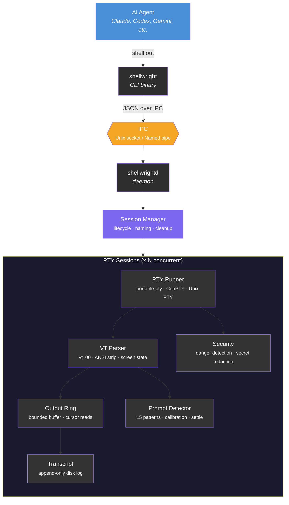

# Shellwright

**Universal CLI Session Broker for AI Agents — Playwright for CLIs**

Shellwright is a cross-platform, PTY-backed session broker that transforms terminal interaction into a clean, machine-readable protocol for AI agents. Any agent that can shell out commands can use Shellwright to drive interactive CLIs.

## Why Shellwright?

AI coding agents hit a wall the moment a CLI asks a question. `npm init` wants a project name. `terraform apply` wants confirmation. `ssh` wants a password. `git rebase -i` opens an editor. The agent's shell tool can't type into these prompts — it hangs, times out, or crashes.



Today's workarounds are fragile: per-tool `--yes` flags that don't cover all cases, MCP servers locked to specific agent frameworks, or ecosystem-specific PTY support (Codex CLI for OpenAI only, Gemini CLI for Google only).

Shellwright fills the gap: **one CLI tool, any agent, any platform, any interactive program.**

## Installation

### npm / npx (no Rust toolchain needed)

```bash
# Install globally
npm install -g shellwright

# Or run directly without installing
npx shellwright start --name build -- npm run build
```

Platform-specific binaries (Windows, macOS, Linux) are bundled automatically.

### Cargo

```bash
cargo install shellwright
```

### From source

```bash
git clone https://github.com/nielsbosma/shellwright
cd shellwright
cargo build --release
```

## Quick Start



### Commands

```bash
shellwright start --name build -- npm run build   # Start session
shellwright read build                             # Read output
shellwright read build --tail 10                   # Last 10 lines
shellwright read build --since 42                  # Since cursor 42
shellwright send build "y"                         # Send input + Enter
shellwright send build "y" --wait-for "done"       # Send + wait
shellwright wait build --for "PASS|FAIL" --timeout 30
shellwright status build                           # State + prompt info
shellwright list                                   # All sessions
shellwright interrupt build                        # Ctrl+C
shellwright terminate build                        # Kill
```

## JSON Output

Every command outputs JSON by default, making it trivially parseable by agents:

```json
{
  "id": "a1b2c3",
  "success": true,
  "data": {
    "session": "build",
    "state": "exited",
    "exit_code": 0,
    "output_file": "/tmp/shellwright/sessions/build/output.txt",
    "output_tail": "Build completed successfully",
    "lines": 847
  }
}
```

Use `--no-json` for human-readable plain text output.

## Architecture



The daemon (`shellwrightd`) auto-starts on first `shellwright` command. Sessions persist across agent restarts. Orphaned sessions are cleaned up after a configurable timeout. The daemon self-exits after 10 minutes with no active sessions.

## Key Features

- **Agent-agnostic**: Works with any agent that can run shell commands
- **Cross-platform**: First-class Windows ConPTY + Unix PTY support
- **Daemon-backed sessions**: Persist across agent crashes and context resets
- **Token-efficient output**: Filesystem-first (file paths + tail), cursor-based reads
- **Prompt detection**: Heuristic + pattern matching with confidence scores
- **Wait-for patterns**: `shellwright wait build --for "PASS|FAIL"` — the `waitForSelector` of CLIs
- **Security**: Dangerous command detection, secret redaction
- **Clean output**: VT terminal emulation strips ANSI noise, collapses progress bars

## Comparison

| Tool | Approach | Limitation |
|---|---|---|
| expect/pexpect | Regex-based PTY scripting | Not structured, no agent protocol |
| mcp-interactive-terminal | Node.js MCP server | Node dependency, Unix-only, MCP-locked |
| Codex CLI (exec_command) | Model-driven PTY sessions | Locked to OpenAI ecosystem |
| Gemini CLI (node-pty) | User-driven embedded terminal | User must interact, not programmatic |
| **Shellwright** | **Standalone CLI session broker** | **Production-grade, cross-platform, agent-agnostic** |

## License

MIT
