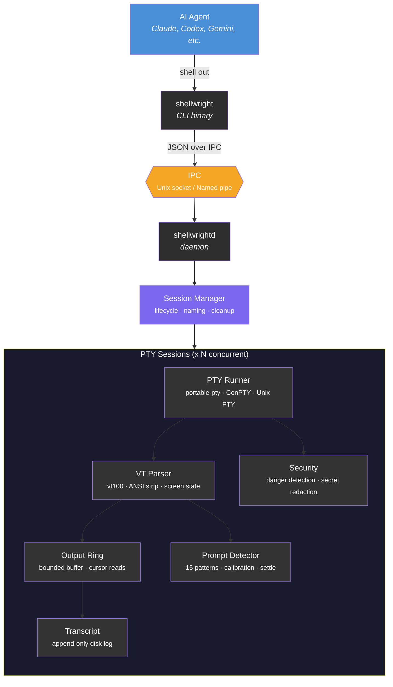

# Shellwright

**Universal CLI Session Broker for AI Agents — Playwright for CLIs**

Shellwright is a cross-platform, PTY-backed session broker that transforms terminal interaction into a clean, machine-readable protocol for AI agents. Any agent that can shell out commands can use Shellwright to drive interactive CLIs.

## Installation

```bash
cargo install shellwright
```

Or build from source:

```bash
git clone https://github.com/shellwright/shellwright
cd shellwright
cargo build --release
```

## Quick Start

```bash
# Start a session
shellwright start --name build -- npm run build

# Read output
shellwright read build

# Send input to a prompt
shellwright send build "y"

# Wait for a pattern in output
shellwright wait build --for "PASS|FAIL" --timeout 30

# List all sessions
shellwright list

# Get session status
shellwright status build

# Send Ctrl+C
shellwright interrupt build

# Terminate a session
shellwright terminate build
```

## JSON Output

Every command outputs JSON by default, making it trivially parseable by agents:

```json
{
  "id": "a1b2c3",
  "success": true,
  "data": {
    "session": "build",
    "state": "exited",
    "exit_code": 0,
    "output_file": "/tmp/shellwright/sessions/build/output.txt",
    "output_tail": "Build completed successfully",
    "lines": 847
  }
}
```

Use `--no-json` for human-readable plain text output.

## Architecture



The daemon (`shellwrightd`) auto-starts on first `shellwright` command. Sessions persist across agent restarts. Orphaned sessions are cleaned up after a configurable timeout. The daemon self-exits after 10 minutes with no active sessions.

## Key Features

- **Agent-agnostic**: Works with any agent that can run shell commands
- **Cross-platform**: First-class Windows ConPTY + Unix PTY support
- **Daemon-backed sessions**: Persist across agent crashes and context resets
- **Token-efficient output**: Filesystem-first (file paths + tail), cursor-based reads
- **Prompt detection**: Heuristic + pattern matching with confidence scores
- **Wait-for patterns**: `shellwright wait build --for "PASS|FAIL"` — the `waitForSelector` of CLIs
- **Security**: Dangerous command detection, secret redaction
- **Clean output**: VT terminal emulation strips ANSI noise, collapses progress bars

## Comparison

| Tool | Approach | Limitation |
|---|---|---|
| expect/pexpect | Regex-based PTY scripting | Not structured, no agent protocol |
| mcp-interactive-terminal | Node.js MCP server | Node dependency, Unix-only, MCP-locked |
| Codex CLI (exec_command) | Model-driven PTY sessions | Locked to OpenAI ecosystem |
| Gemini CLI (node-pty) | User-driven embedded terminal | User must interact, not programmatic |
| **Shellwright** | **Standalone CLI session broker** | **Production-grade, cross-platform, agent-agnostic** |

## License

MIT
